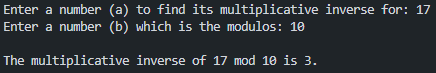

# ITNE361
## This code is done by:
- Sayed Jaafar Sadeq - 20184311
- Maitham Ali Isa - 20186039

=========================================

The language used is: Python

### 1- Asking the user to enter 2 positive integer and find the Multiplicative inverse of it, and if there is no multiplicative inverse it will show you the output.

### 2-  python 3.x (no matter the verion)

### 3- The user must enter 2 positive number (a) to find the multiplicative invers for and the modules (b), after the user enter these data, the program will module (a) % (b) and the output will be in terminal

### 4- Enter a number (a) to find its multiplicative inverse for: 3
   Enter a number (b) which is the modulos: 11

   The multiplicative inverse of 3 mod 11 is 4.

### 5- 

### 6- Test your program with the following inputs:  
    a. Input: 3 and 11
    b. Input: 10 and 17 
    c. Input: 2 and 4

### A. 

### B. 

### C.

